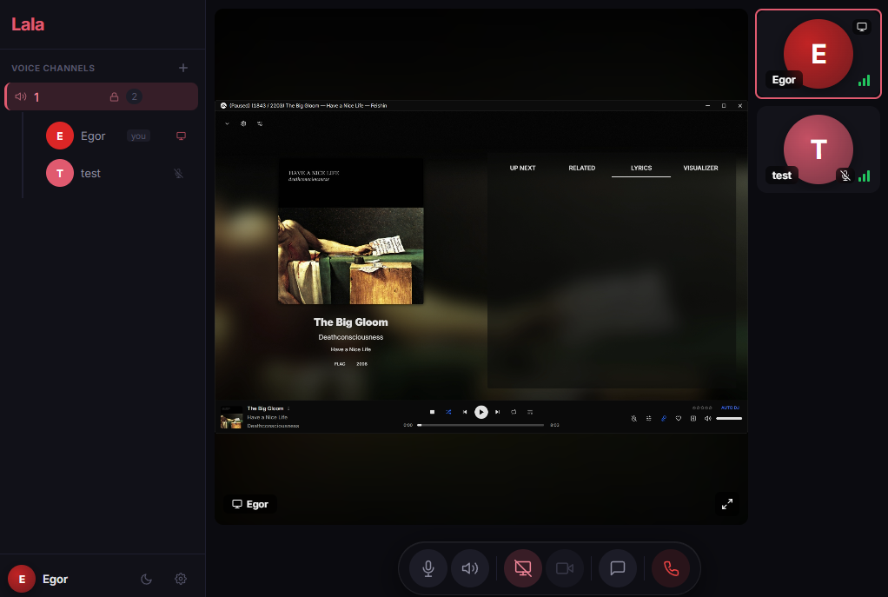
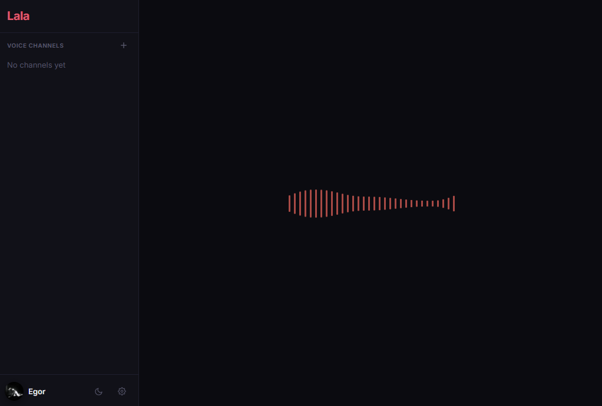
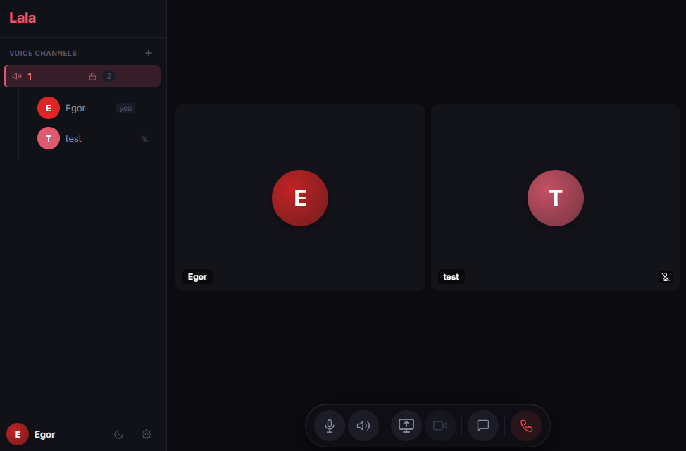

# Lala

Self-hosted voice & video chat inspired by Mumble and Discord.
Built on [LiveKit](https://livekit.io/) (WebRTC SFU). No database — rooms are ephemeral, chat goes over data channels, state lives in LiveKit + Redis.



**Try it:** [lala.egor-solovev.dev](https://lala.egor-solovev.dev)

## What it does

- Voice and video with configurable audio quality (speech / music / high-quality stereo)
- E2EE for password-protected rooms (AES-GCM, server never sees plaintext)
- Screen sharing with quality/FPS controls and system audio (Windows)
- Chat over data channels with emoji picker and TTS
- Room admin — kick, ban, mute; passwords hashed with scrypt
- 5 themes — dark, light, AMOLED, Discord, Windows XP
- RNNoise noise suppression (AudioWorklet)
- Desktop app with auto-updates, tray, native screen share picker

<p>
  
  
</p>

## Desktop app

Works in any browser, but there's a native client too:

- **Windows** — installer from [Releases](https://github.com/eeegoloauq/lala/releases), auto-updates itself.
- **Fedora** — via [Copr](https://copr.fedorainfracloud.org/coprs/eeegoloauq/lala/), updates come with `dnf upgrade`:

  ```bash
  sudo dnf copr enable eeegoloauq/lala
  sudo dnf install lala-desktop
  ```

- **Other Linux** — AppImage / rpm / tar.gz from [Releases](https://github.com/eeegoloauq/lala/releases).

## Self-hosting

You need: Docker, a server with a public IP, a domain.

There are no prebuilt public images — build the two images from the repo root
(the root is the build context so `packages/shared` is reachable), then point
compose at them:

```bash
git clone https://github.com/eeegoloauq/lala.git
cd lala
cp .env.example .env
# edit .env — set your IP, domain, LiveKit keys, Redis password;
# for a local build set LALA_REGISTRY=local and LALA_TAG=dev

docker build -f packages/api/Dockerfile -t local/homelab/lala-api:dev .
docker build -f packages/web/Dockerfile \
  --build-arg VITE_LIVEKIT_URL=wss://rtc.example.com \
  -t local/homelab/lala-web:dev .

docker compose up -d
```

Web UI runs on port 3000. Put a reverse proxy in front for TLS — both for the
UI and for LiveKit signaling (`wss://rtc.example.com` → `:7880`).

> Note: `LIVEKIT_URL` is baked into the web image at build time
> (`VITE_LIVEKIT_URL`), so rebuild `lala-web` if it changes.

### Environment

| Variable | What |
|----------|------|
| `LIVEKIT_URL` | WebSocket URL clients connect to (`wss://rtc.example.com`) |
| `LIVEKIT_API_KEY` / `LIVEKIT_API_SECRET` | LiveKit credentials |
| `NODE_IP` | Server public IP (WebRTC ICE) |
| `LIVEKIT_DOMAIN` | Domain for TURN (must resolve to the server) |
| `REDIS_PASSWORD` | Redis password (`openssl rand -hex 24`) |
| `LALA_REGISTRY` / `LALA_TAG` | Where compose pulls the api/web images from |
| `ALLOWED_ORIGINS` | Allowed frontend origins (CORS) |
| `CSP_CONNECT_SRC` | CSP connect-src (default `wss: ws:`, tighten for prod) |

### Ports

| Port | Proto | What |
|------|-------|------|
| 3000 | TCP | Web UI (nginx → SPA + API proxy) |
| 7880 | TCP | LiveKit signaling |
| 7881 | TCP | ICE/TCP fallback |
| 50000 | UDP | Media |
| 3478 | UDP | TURN |

## Architecture

```
Browser → Nginx (:3000)
            ├── /       → React SPA
            └── /api/*  → Express API (:3001)
          → LiveKit (:7880 WS, :50000/udp, :3478/udp TURN)
```

Four packages:

- `packages/api` — Express. Token generation, room CRUD, admin actions, SSE. Uses `livekit-server-sdk` v2.
- `packages/web` — Vite + React. `livekit-client` v2, custom UI.
- `packages/desktop` — Electron. Native screen share, tray, auto-updates.
- `packages/shared` — types-only wire contract between api and web.

No database. Identity = HMAC of a stable device UUID — same device, same participant, always.

## Security

- E2EE via WebCrypto AES-GCM (password = encryption key)
- HMAC identity — unforgeable without the API secret
- Passwords stored as scrypt hashes, constant-time comparison
- Admin secrets: 128-bit random, Redis-only (never in room metadata)
- Rate limiting: nginx + Express, client-side chat throttle
- Input sanitization: null bytes, RTL overrides, control chars stripped
- CSP without inline scripts, X-Frame-Options, X-Content-Type-Options, HSTS
- Containers run as non-root with `no-new-privileges` and memory limits

Found a vulnerability? See [SECURITY.md](SECURITY.md).

## Local dev

```bash
cd packages/api && npm install && npm run dev   # :3001
cd packages/web && npm install && npm run dev   # :3000
```

## Contributing

Issues and PRs are welcome — see [CONTRIBUTING.md](CONTRIBUTING.md) for the dev setup, how to
test changes (with a real call), and what to expect. Keep changes small and focused; for anything
bigger than a fix, open an issue first so we can talk it over.

## License

[MIT](LICENSE)
