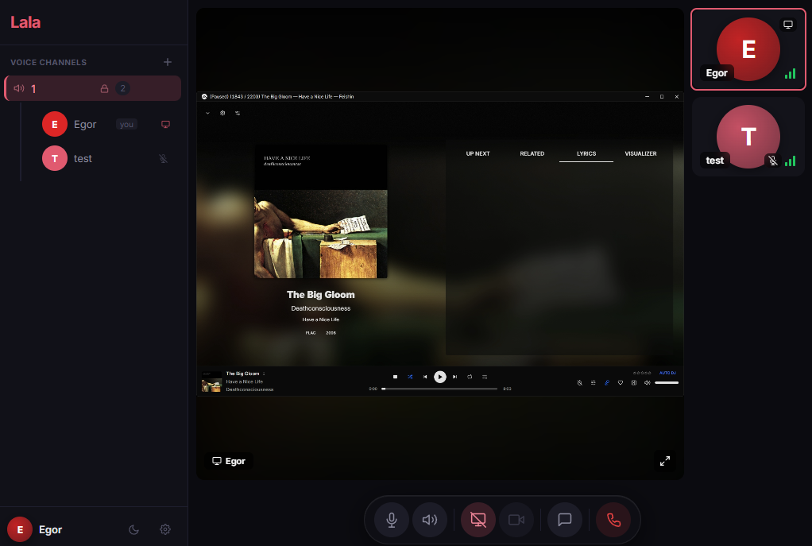
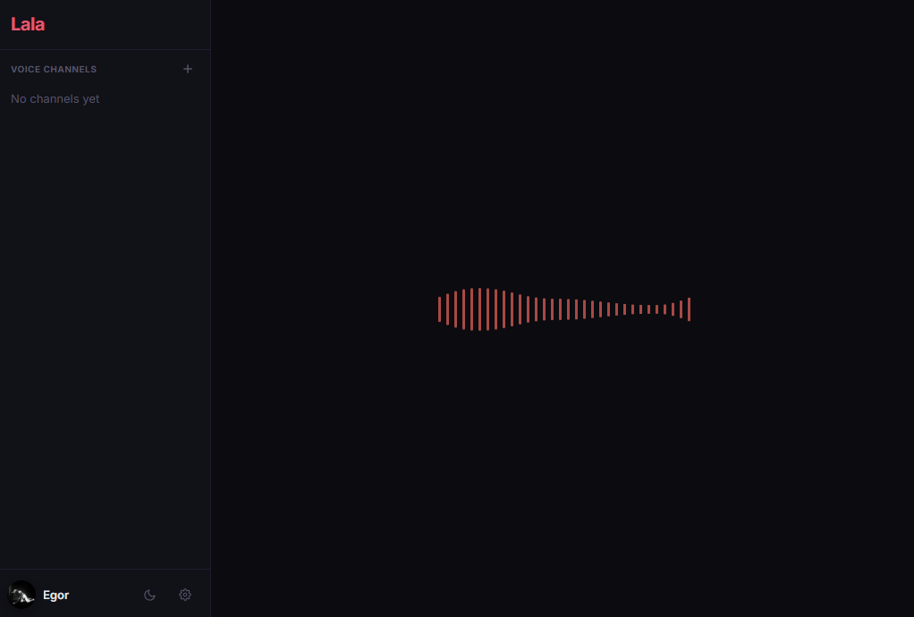
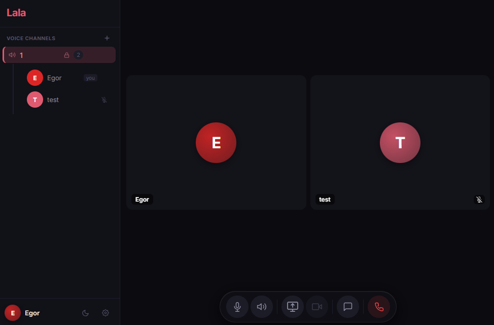

# Lala

Self-hosted voice and video chat inspired by Mumble and Discord, built on
[LiveKit](https://livekit.io/). No database: rooms are ephemeral, chat goes over data channels, and
state lives in LiveKit and Redis.

[](https://github.com/eeegoloauq/lala/releases/latest)
[](https://github.com/eeegoloauq/lala/actions/workflows/images.yml)
[](https://copr.fedorainfracloud.org/coprs/eeegoloauq/lala/)
[](LICENSE)

Demo: [lala.egor-solovev.dev](https://lala.egor-solovev.dev)



## What it does

- Voice and video with configurable audio quality (speech / music / high-quality stereo)
- End-to-end encryption for password-protected rooms in browsers that support it (AES-GCM)
- Screen sharing with quality/FPS controls and system audio (Windows)
- Chat over data channels with emoji picker and TTS
- Room admin: kick, ban, mute; passwords hashed with scrypt
- 5 themes: dark, light, AMOLED, Discord, Windows XP
- RNNoise noise suppression (AudioWorklet)
- Desktop app with auto-updates, tray, native screen share picker

<p>
  
  
</p>

## Desktop app

Lala works in the browser. There is also a desktop client:

- **Windows**: installer from [Releases](https://github.com/eeegoloauq/lala/releases), auto-updates itself.
- **Fedora**: [Copr](https://copr.fedorainfracloud.org/coprs/eeegoloauq/lala/), updated with `dnf upgrade`:

  ```bash
  sudo dnf copr enable eeegoloauq/lala
  sudo dnf install lala-desktop
  ```

- **Other Linux**: AppImage / rpm / tar.gz from [Releases](https://github.com/eeegoloauq/lala/releases).

## Self-hosting

You need: Docker, a server with a public IP, a domain.

The four containers use about 75 MB of RAM when idle; LiveKit grows during calls.

The web image has the LiveKit URL built in, so build the images yourself. Use the repo root as the
build context so `packages/shared` is included:

```bash
git clone https://github.com/eeegoloauq/lala.git
cd lala
cp .env.example .env
# edit .env — set your IP, domain, LiveKit keys, Redis password;
# for a local build set LALA_REGISTRY=local and LALA_TAG=dev

docker build -f packages/api/Dockerfile -t local/homelab/lala-api:dev .
docker build -f packages/web/Dockerfile \
  --build-arg VITE_LIVEKIT_URL=wss://rtc.example.com \
  -t local/homelab/lala-web:dev .

docker network create edge   # compose attaches web and LiveKit to it for your reverse proxy
docker compose up -d
```

The web UI runs on port 3000. Put a reverse proxy with TLS in front of it and of LiveKit
signaling (`wss://rtc.example.com` → `:7880`). If `LIVEKIT_URL` changes, rebuild `lala-web` with
the new `VITE_LIVEKIT_URL`.

### Environment

| Variable | What |
|----------|------|
| `LIVEKIT_URL` | WebSocket URL clients connect to (`wss://rtc.example.com`) |
| `LIVEKIT_API_KEY` / `LIVEKIT_API_SECRET` | LiveKit credentials |
| `NODE_IP` | Server public IP (WebRTC ICE) |
| `LIVEKIT_DOMAIN` | Domain for TURN (must resolve to the server) |
| `REDIS_PASSWORD` | Redis password (`openssl rand -hex 24`) |
| `LALA_REGISTRY` / `LALA_TAG` | Where compose pulls the api/web images from |
| `ALLOWED_ORIGINS` | Allowed frontend origins (CORS) |
| `CSP_CONNECT_SRC` | CSP connect-src (default `wss: ws:`, tighten for prod) |

### Ports

| Port | Proto | What |
|------|-------|------|
| 3000 | TCP | Web UI (nginx → SPA + API proxy) |
| 7880 | TCP | LiveKit signaling |
| 7881 | TCP | ICE/TCP fallback |
| 50000 | UDP | Media |
| 3478 | UDP | TURN |

## Architecture

```
Browser → Nginx (:3000)
            ├── /       → React SPA
            └── /api/*  → Express API (:3001)
          → LiveKit (:7880 WS, :50000/udp, :3478/udp TURN)
```

Four packages:

- `packages/api`: Express. Token generation, room CRUD, admin actions, SSE. Uses `livekit-server-sdk` v2.
- `packages/web`: Vite and React. `livekit-client` v2, custom UI.
- `packages/desktop`: Electron. Native screen share, tray, auto-updates.
- `packages/shared`: shared types for the api and web wire format.

Identity is an HMAC of a stable device UUID, so the same device is always the same participant.

## Security

- End-to-end encryption with LiveKit's E2EE (AES-GCM), keyed from the room password
- HMAC identity that cannot be forged without the API secret
- Passwords stored as scrypt hashes, constant-time comparison
- Admin secrets: 128-bit random, Redis-only (never in room metadata)
- Rate limiting in nginx and Express; null bytes, RTL overrides and control chars stripped from input
- CSP without inline scripts, HSTS, containers non-root with `no-new-privileges` and memory limits

Found a vulnerability? See [SECURITY.md](SECURITY.md).

## Local dev

```bash
cd packages/api && npm install && npm run dev   # :3001
cd packages/web && npm install && VITE_LIVEKIT_URL=wss://rtc.example.com npm run dev   # :3000
```

## Contributing

Issues and PRs are welcome. [CONTRIBUTING.md](CONTRIBUTING.md) covers the dev setup and testing
with a real call. For anything bigger than a fix, open an issue first.

## License

[MIT](LICENSE)
